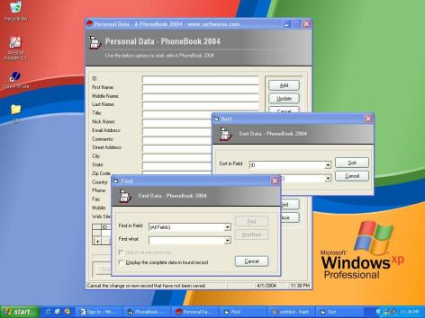



## Pro PhoneBook 2004 \- New Version

### Description

A Complete PhoneBook Aplication. Powerfull an very simple, fast, friendly contact management phone book software with printing ability/report-Easy to understand screen layout. Perfect for sales leads, customer database, vendor database, business/personal contacts, and much more. Please give us your feedback on how we can make this software better to suit your needs. We appreciate your input
 
### More Info
 

             |
---                |---
**Submitted On**   |2004-04-02 00:10:24
**By**             |[Pui Yiu Tam](https://github.com/Planet-Source-Code/PSCIndex/blob/master/ByAuthor/pui-yiu-tam.md)
**Level**          |Advanced
**User Rating**    |4.9 (44 globes from 9 users)
**Compatibility**  |VB 6\.0
**Category**       |[Complete Applications](https://github.com/Planet-Source-Code/PSCIndex/blob/master/ByCategory/complete-applications__1-27.md)
**World**          |[Visual Basic](https://github.com/Planet-Source-Code/PSCIndex/blob/master/ByWorld/visual-basic.md)
**Archive File**   |[Pro\_PhoneB176718772004\.zip](https://github.com/Planet-Source-Code/pui-yiu-tam-pro-phonebook-2004-new-version__1-52803/archive/master.zip)

